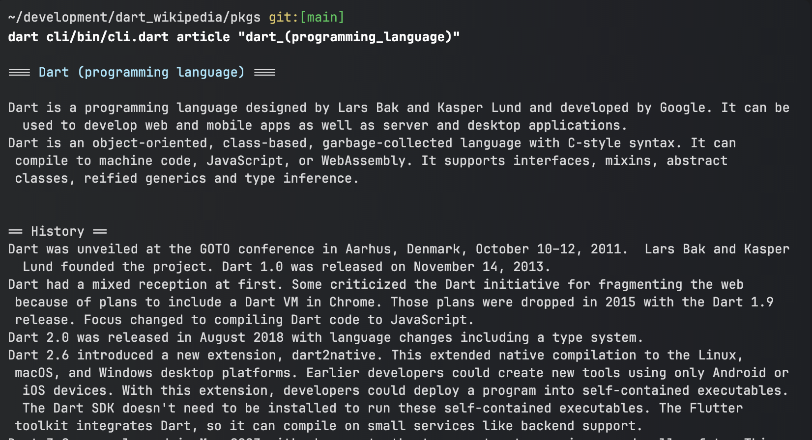

# Dart Wikipedia Cli

Prints Wikipedia articles to the terminal.




```text
Usage: dart bin/cli.dart <command> [commandArg?] [...options?] 
help:  Prints usage information to the command line. 
           Prints this usage information 
           Options: 
           -v,--verbose: When true, this command will print each command and its options. 
           -c,--command: When a command is passed as an argument, prints only that command's verbose usage. 
search:  Search for Wikipedia articles. 
           Prints a list of links to Wikipedia articles that match the given term. 
           [Argument] Required? false, Type: STRING, Default: none 
           Options: 
           --im-feeling-lucky: If true, prints the summary of the top article that the search returns. 
article:  Read an article from Wikipedia 
           Gets an article by exact canonical wikipedia title. 
           [Argument] Required? false, Type: STRING, Default: cat 
```